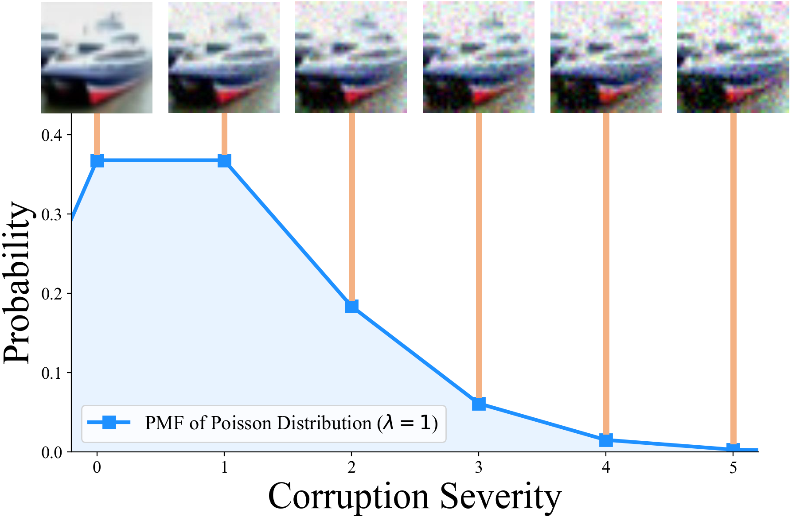

## [SharpDRO: Robust Generalization against Photon-Limited Corruptions via Worst-Case Sharpness Minimization](https://arxiv.org/pdf/2303.13087.pdf)




This is an PyTorch implementation of SharpDRO.

## Requirements
- python 3.6+
- torch 1.4
- torchvision 0.5
- numpy

## Usage

### Dataset Preparation
This repository needs CIFAR10, CIFAR100, or ImageNet-30 to train a model.

First please follow instructions of [Benchmarking Neural Network Robustness to Common Corruptions and Perturbations](https://github.com/hendrycks/robustness) to generate common corruptions. The codes for CIFAR10, CIFAR100, and ImageNet-30 can also be found in `./corruptions/`.

Then, the photon-limited corruptions with poisson distribution would be automatically produced by `./dataset/prepare_dataset.py`.

For ImageNet-30, we provide a pre-splited file lists in `./imagenet30_filelist/` folder. To generate your own file lists, you can run `python ./imagenet30_filelist/split_imagenet30.py`

All datasets are supposed to be under ./data.

### Train
Train your model:

```
python main.py --num_severity number-of-selected-severities -c type-of-the-corruption  -n number-of-training-data-per-class --lr 0.1 --total_epoch 200 -d dataset --log_dir logs --desc training-description
```

### Acknowledgement
Some of the codes are depend on [Distributionally Robust Neural Networks for Group Shifts: On the Importance of Regularization for Worst-Case Generalization](https://github.com/kohpangwei/group_DRO). 
 Appreciate their contributions.

### Reference
If you find this code helpful, please consider citing our paper, thanks!

```
@article{huang2023robust,
  title={Robust Generalization against Photon-Limited Corruptions via Worst-Case Sharpness Minimization}, 
  author={Zhuo Huang and Miaoxi Zhu and Xiaobo Xia and Li Shen and Jun Yu and Chen Gong and Bo Han and Bo Du and Tongliang Liu},
  journal={arXiv preprint arXiv:2303.13087},
  year={2023}
}
```

